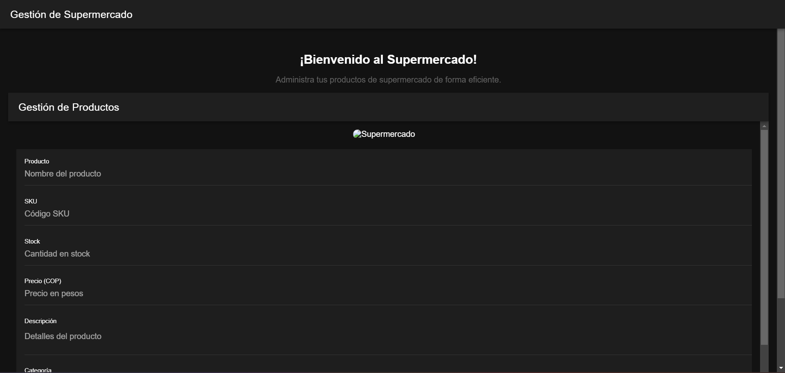

# programacion-movil-c3-q2

## Manual del Proyecto

### 1. Introducción
Este proyecto se centra en la creación de un sistema de gestión de productos para un supermercado, desarrollado con Ionic Vue. Incluye componentes individuales y agrupados para manejar las funciones CRUD de manera eficiente. La estructura modular de los componentes permite que sean reutilizables y fáciles de mantener, asegurando una experiencia de usuario fluida.

### 2. Objetivo
El objetivo del proyecto es construir una aplicación práctica y eficiente para gestionar productos en un entorno de supermercado, haciendo uso de componentes desarrollados con Vue.js y Ionic Framework. Los componentes han sido diseñados para ser fácilmente integrables y adaptables, lo que permite una experiencia de usuario optimizada y una estructura de código limpia y mantenible.

---

## Contenido
1. [Introducción](#1-introducción)
2. [Objetivo](#2-objetivo)
3. [Requisitos Previos](#requisitos-previos)
4. [Instalación del Proyecto](#instalación-del-proyecto)
5. [Ejecución del Proyecto](#ejecución-del-proyecto)
6. [Componentes Incluidos](#componentes-incluidos)
7. [Evidencias de Funcionamiento](#evidencias-de-funcionamiento)
8. [Enlace del Video Explicativo](#enlace-del-video-explicativo)

---

## Requisitos Previos

Antes de iniciar, asegúrate de tener instalados los siguientes programas:
- [Node.js](https://nodejs.org/) (v12 o superior)
- [NPM](https://www.npmjs.com/) (se instala con Node.js)
- [Ionic CLI](https://ionicframework.com/docs/cli) (instalar con el comando `npm install -g @ionic/cli`)

---

## Instalación del Proyecto

Sigue estos pasos para clonar e instalar el proyecto:

1. **Clona el repositorio:**
   ```bash
   git clone https://github.com/Marlon271/programacion-movil-c3-q2.git
   ```
2. **Accede al directorio del proyecto:**
   ```bash
   cd programacion-movil-c3-q2
   ```
3. **Instala las dependencias:**
   ```bash
   npm install
   ```

---

## Ejecución del Proyecto

Para ejecutar el proyecto en un servidor local de desarrollo:
```bash
ionic serve
```
Esto abrirá el proyecto en tu navegador predeterminado. Puedes acceder a la aplicación desde [http://localhost:8100](http://localhost:8100).

---

## Componentes Incluidos

1. **ProductInput.vue**: Componente reutilizable para capturar el nombre del producto.
2. **ProductForm.vue**: Componente que agrupa múltiples campos (nombre, SKU, precio) y un botón para guardar productos.
3. **ComponentCrud.vue**: Componente completo para manejar todas las operaciones CRUD de los productos.
4. **HomePage.vue**: Vista principal que integra `ComponentCrud.vue` para gestionar productos.

### Descripción de la Conexión
- `ProductForm.vue` utiliza `ProductInput.vue` para crear un campo de entrada modular.
- `HomePage.vue` muestra `ComponentCrud.vue` para centralizar la gestión de productos en una sola página.

---

## Evidencias de Funcionamiento

Aquí se presentan las capturas de pantalla de la aplicación en funcionamiento:





*Las imágenes demuestran que los componentes funcionan como se espera y permiten la gestión eficaz de los productos del supermercado.*

---

## Enlace del Video Explicativo

Puedes ver el video explicativo sobre cómo se creó e integró cada componente en el siguiente enlace:
- **[Enlace al Video](https://drive.google.com/file/d/1_KfXLrA90ihw1fgJHHlIa80OGillLubc/view?usp=sharing)**

---

### Notas Finales
Este proyecto demuestra cómo estructurar una aplicación de supermercado usando componentes modulares con Ionic Vue. La documentación incluye detalles sobre la instalación, ejecución y componentes desarrollados, junto con evidencias visuales del funcionamiento.

---

### **Instrucciones para Subir a GitHub**
1. **Crea un archivo `README.md`** en la raíz de tu proyecto y copia este contenido.
2. **Asegúrate de subir las capturas de pantalla a la carpeta `img`** en tu proyecto.
3. **Añade y confirma tus cambios**:
   ```bash
   git add .
   git commit -m "Agregando documentación y evidencias"
   git push origin main
   ```

